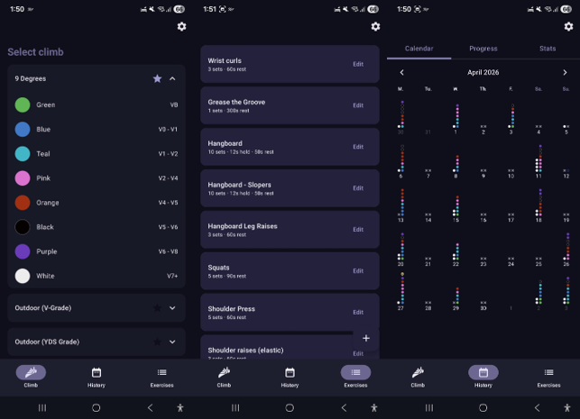
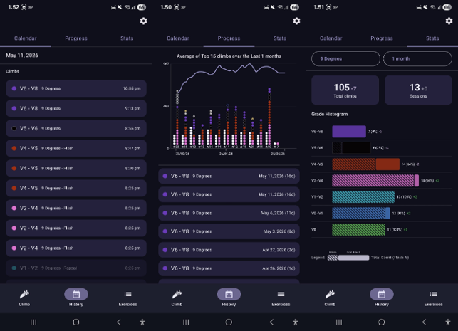

<p align="center">
  
</p>

<h1 align="center">Ranni</h1>

<p align="center">
  A minimal Android app for tracking bouldering sessions and exercises at the climbing gym.
</p>

<p align="center">
  
  
  
  
</p>

---

## Features

**Climb Logging** — Tap to log boulder routes by colour and grade. Supports gym-specific route systems (9 Degrees), outdoor gyms with YDS and V grading, and a generic V-scale option.

**Exercise Timer** — Create custom exercises with configurable sets, set duration, and rest timers. Audio cues signal when intervals end.

**History & Progress** — Calendar view of past sessions and a progress graph with configurable metrics (top climbs, time range).

**Scoring** — Each route grade has a point value; track your climbing score over time.

**Injury Tracking** — Log and monitor injuries alongside your sessions.

**Wear OS** *(in development)* — Log climbs directly from your wrist. The watch app shows your gyms and routes, lets you select a climb type (New / Flash / Repeat), and syncs the entry to your phone via the Wearable Data Layer. Not available via Releases — requires building from source and installing via Android Studio.

## Screenshots

<p align="center">
  
</p>

<p align="center">
  
</p>

## Tech Stack

| | |
|---|---|
| Language | Kotlin |
| UI | Jetpack Compose, Material 3 |
| Database | Room |
| Architecture | MVVM, sealed-class navigation |

## Install

1. Go to the [Releases](../../releases) page
2. Download the latest APK
3. Install on your Android device (Android 10+ required)

Check the changelog inside the app (**Settings → About**) for what's changed between versions.

## Building

If you want to build from source, open the project in Android Studio and run on a device or emulator.

```
minSdk 29 · targetSdk 35
```
